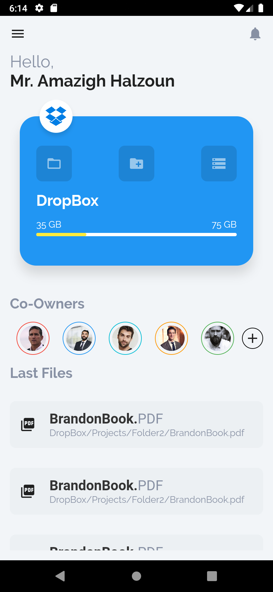
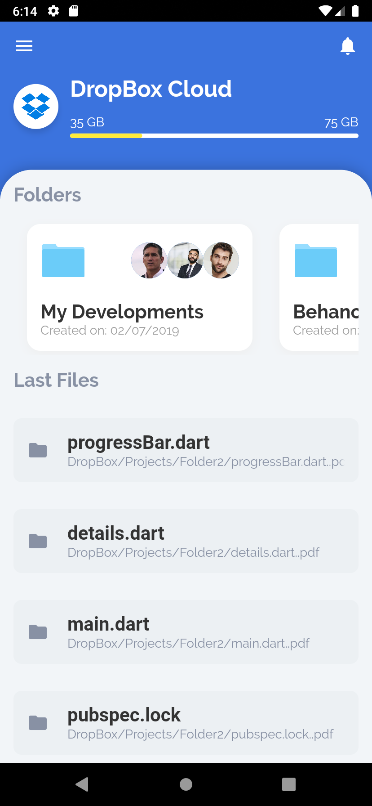

# cloud_storage_status

Get me a coffee:

Bitcoin Address: 1DiFn7B9APaQJKfYAKqesnGM2eVM1MW6U

Ethereum Address: 0xAdc43dadbE2b64DC9ba1c8766764F7cD4a2Fa915

Paypal: https://www.paypal.com/cgi-bin/webscr?cmd=_s-xclick&hosted_button_id=THDYKD8QG27HN&source=url

Patreon: https://www.patreon.com/cybdom

Twitter: https://twitter.com/cybdom

Behance:
https://www.behance.net/cybdom

## Getting Started

This project is a starting point for a Flutter application.

A few resources to get you started if this is your first Flutter project:

- [Lab: Write your first Flutter app](https://flutter.dev/docs/get-started/codelab)
- [Cookbook: Useful Flutter samples](https://flutter.dev/docs/cookbook)

For help getting started with Flutter, view our
[online documentation](https://flutter.dev/docs), which offers tutorials,
samples, guidance on mobile development, and a full API reference.
